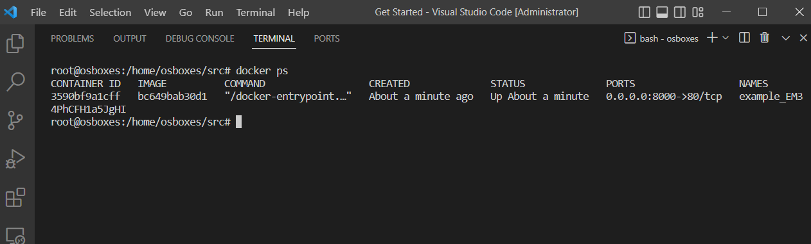
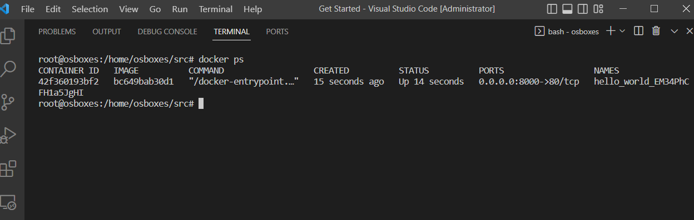

# `Домашнее задание к занятию «Введение в Terraform» - Зозуля Максим`

### Задание 1

1. Перейдите в каталог [**src**](https://github.com/netology-code/ter-homeworks/tree/main/01/src). Скачайте все необходимые зависимости, использованные в проекте. 
2. Изучите файл **.gitignore**. В каком terraform-файле, согласно этому .gitignore, допустимо сохранить личную, секретную информацию?
3. Выполните код проекта. Найдите  в state-файле секретное содержимое созданного ресурса **random_password**, пришлите в качестве ответа конкретный ключ и его значение.
4. Раскомментируйте блок кода, примерно расположенный на строчках 29–42 файла **main.tf**.
Выполните команду ```terraform validate```. Объясните, в чём заключаются намеренно допущенные ошибки. Исправьте их.
5. Выполните код. В качестве ответа приложите: исправленный фрагмент кода и вывод команды ```docker ps```.
6. Замените имя docker-контейнера в блоке кода на ```hello_world```. Не перепутайте имя контейнера и имя образа. Мы всё ещё продолжаем использовать name = "nginx:latest". Выполните команду ```terraform apply -auto-approve```.
Объясните своими словами, в чём может быть опасность применения ключа  ```-auto-approve```. В качестве ответа дополнительно приложите вывод команды ```docker ps```.
8. Уничтожьте созданные ресурсы с помощью **terraform**. Убедитесь, что все ресурсы удалены. Приложите содержимое файла **terraform.tfstate**. 
9. Объясните, почему при этом не был удалён docker-образ **nginx:latest**. Ответ **обязательно** подкрепите строчкой из документации [**terraform провайдера docker**](https://docs.comcloud.xyz/providers/kreuzwerker/docker/latest/docs).  (ищите в классификаторе resource docker_image )

### Ответ:
---

В соответствии с файлом .gitignore, личная и секретная информация может быть сохранена в файле personal.auto.tfvars.

---
Чтобы найти секретное содержимое созданного ресурса **random_password**, нужно выполнить команду **terraform show** после применения конфигурации. Однако, так как ресурс **random_password** в коде не использует пользовательские переменные, там нет секретной информации.

---
В строке *name = "example_${random_password.random_string_FAKE.resulT}"* использован неправильный синтаксис переменной.
Ошибка в имени ресурса. Вместо *resource "docker_container" "1nginx"* надо *resource "docker_container" "nginx"*
блок *resource "docker_image"* не содержит имя ресурса


исправленый код
```
terraform {
  required_providers {
    docker = {
      source  = "kreuzwerker/docker"
      version = "~> 3.0.1"
    }
  }
  required_version = ">=0.13" /*Многострочный комментарий.
 Требуемая версия terraform */
}
provider "docker" {}

#однострочный комментарий

resource "random_password" "random_string" {
  length      = 16
  special     = false
  min_upper   = 1
  min_lower   = 1
  min_numeric = 1
}


resource "docker_image" "nginx" {
  name         = "nginx:latest"
  keep_locally = true
}

resource "docker_container" "nginx" {
  image = docker_image.nginx.image_id
  name  = "example_${random_password.random_string.result}"

  ports {
    internal = 80
    external = 8000
  }
}

```



---
Ключ **-auto-approve** позволяет выполнить **terraform apply** без запроса подтверждения, что может быть опасно, так как изменения в инфраструктуре могут быть выполнены без вмешательства оператора.



---
```
"version": 4,
  "terraform_version": "1.6.1",
  "serial": 12,
  "lineage": "918891af-f115-37c4-872b-52bc8c9c198a",
  "outputs": {},
  "resources": [],
  "check_results": null
}
```

---
В файле terraform.tfstate нет информации о docker-образе nginx:latest, так как Terraform не управляет Docker